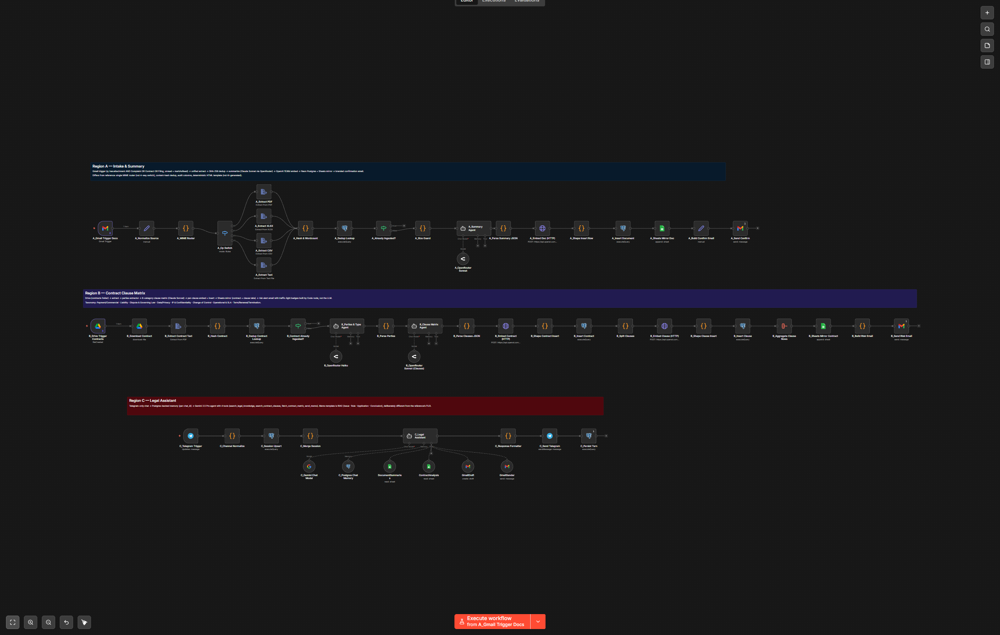
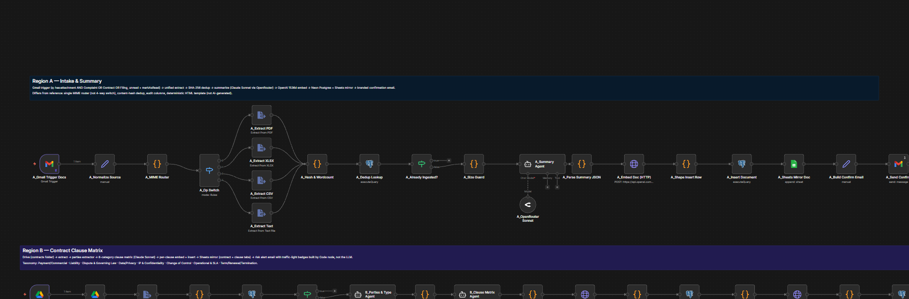
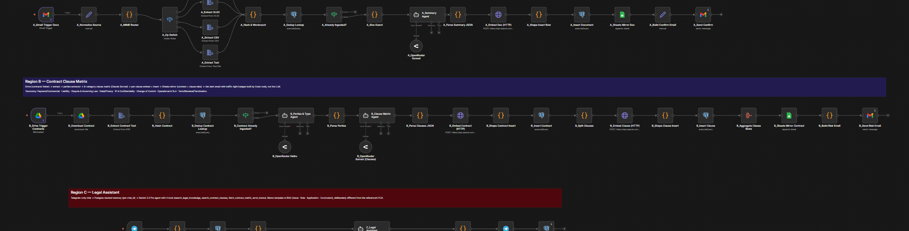
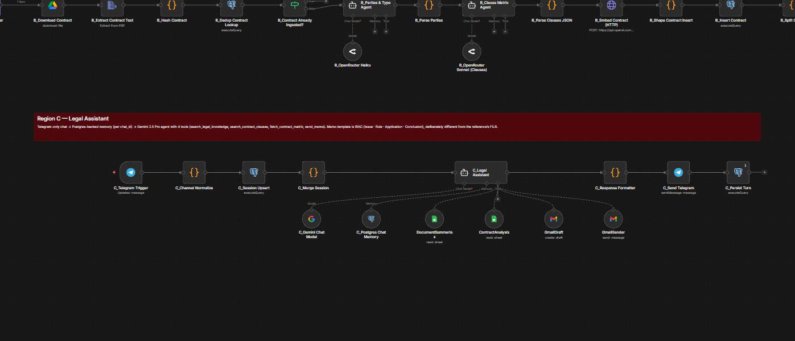

# Legal AI Agent

> A single n8n workflow that delivers three legal-AI capabilities for a small law firm: document intake & summary, contract clause matrix, and a Telegram chatbot that answers from your firm's own corpus and drafts IRAC memos.



## What it does

Three regions on one canvas, each end-to-end:

### Region A — Document Intake & Summary
- Watches Gmail for unread mail matching `has:attachment (Complaint OR Contract OR Filing)`.
- Extracts text from PDF / DOCX / XLSX / CSV / plain text.
- Dedups by content hash so re-sent emails don't double-ingest.
- Sends to a Claude Sonnet **summary agent** that returns issues, deadlines, suggested routing, and a short executive brief.
- Embeds the doc (OpenAI 1536d), inserts to Postgres, mirrors the row to a Google Sheet, sends a confirm email to the team.

### Region B — Contract Clause Matrix
- Watches a Drive folder for new contracts.
- A **Parties & Type** agent (Claude Haiku) extracts the structured contract metadata.
- A **Clause Matrix** agent (Claude Sonnet) breaks the contract into 8 clause categories: Payment & Commercial Terms, Liability Allocation, Dispute Resolution & Governing Law, Data Protection & Privacy, IP & Confidentiality, Change-of-Control & Assignment, Operational Obligations & SLAs, Term/Renewal/Termination.
- Embeds each clause individually, stores in Postgres, mirrors to a Sheet, sends a risk-summary email.

### Region C — Legal Assistant chatbot
- Telegram trigger → **Gemini 2.5 Pro agent** with **four tools**:
  1. `DocumentSummaries` — read the Documents sheet
  2. `ContractAnalysis` — read the Contracts sheet
  3. `GmailDraft` — save a draft memo in Gmail Drafts
  4. `GmailSender` — send a final memo
- **Postgres chat memory** isolated per project (`legal_chat_histories` table).
- Responses formatted as IRAC memos (Statement of Facts / Issues Presented / Legal Analysis / Recommendations).
- Telegram replies are **chunked** to respect the 4096-char limit.

## Architecture

```mermaid
flowchart TB
    subgraph A[Region A: Document Intake & Summary]
        GM[Gmail Trigger] --> NA[Normalize] --> MR{MIME Router}
        MR --> EX[Extract Text]
        EX --> DA[Dedup] --> SA[Summary Agent - Sonnet]
        SA --> EM[Embed 1536d] --> IA[Insert legal_documents]
        IA --> SH1[Sheets Mirror] --> CE[Confirm Email]
    end
    subgraph B[Region B: Contract Clause Matrix]
        DT[Drive Trigger] --> DOC[Download + Extract PDF] --> DB[Dedup]
        DB --> PA[Parties Agent - Haiku] --> CM[Clause Matrix Agent - Sonnet]
        CM --> ICL[Insert clauses one-by-one] --> SH2[Sheets Mirror] --> RE[Risk Email]
    end
    subgraph C[Region C: Legal Assistant]
        TG[Telegram Trigger] --> CA[Legal Assistant - Gemini]
        CA -- tool --> TD[DocumentSummaries]
        CA -- tool --> TC[ContractAnalysis]
        CA -- tool --> GD[GmailDraft]
        CA -- tool --> GS[GmailSender]
        MEM[(Postgres Chat Memory)] -- ai_memory --> CA
        CA --> RF[Response Formatter] --> ST[Send Telegram chunks]
    end
```



## Tech stack

- [n8n](https://n8n.io) (self-hosted)
- **Neon Postgres** with `pgvector`
- **Claude Sonnet 4 / Haiku** via OpenRouter (summary, clauses, parties)
- **Google Gemini 2.5 Pro** (chatbot)
- **OpenAI** embeddings (`text-embedding-3-small`, 1536 dims)
- **Google Workspace**: Gmail (intake + send), Drive (contracts), Sheets (mirror), Docs
- Telegram Bot API

## Setup

### 1. Database

1. Provision Neon (or any Postgres ≥ 14 with `pgvector`).
2. Apply schema **in order**:
   - [`sql/000_pgvector_and_documents.sql`](sql/000_pgvector_and_documents.sql) — enables `vector` extension; required dependency.
   - [`sql/010_legal_ai.sql`](sql/010_legal_ai.sql) — `legal_documents`, `legal_contracts`, `legal_clauses`, `legal_chat_sessions`, `legal_chat_messages`, `legal_errors` tables.
3. (Optional, recommended) Create a least-privilege role for the chatbot tools:
   ```sql
   CREATE ROLE legal_ro LOGIN PASSWORD '<strong-password>';
   ALTER ROLE legal_ro SET statement_timeout = '5s';
   GRANT USAGE ON SCHEMA public TO legal_ro;
   GRANT SELECT ON legal_documents, legal_contracts, legal_clauses,
                   legal_chat_sessions, legal_chat_messages TO legal_ro;
   ```

### 2. Google Workspace

- Create a Drive folder for inbound contracts. Note its ID — you'll set it on `B_Drive Trigger Contracts` after import.
- Create two Google Sheets:
  - **Documents sheet** with tab `Documents`, headers: `Date | Subject | Issue 1 | Issue 2 | Issue 3 | Issue 4 | Issue 5 | Deadline | Full Summary`
  - **Contracts sheet** with tab `Contracts`, headers: `Contract | Analysis`
- Note both sheet IDs.

### 3. Self-host n8n

```bash
docker run -it --rm --name n8n -p 5678:5678 -v n8n_data:/home/node/.n8n n8nio/n8n
```

### 4. Create credentials in n8n

| Purpose | Credential type | Used by |
|---|---|---|
| Gmail OAuth2 | `gmailOAuth2` | A intake, A confirm email, B risk email, C send memo |
| Google Drive OAuth2 | `googleDriveOAuth2Api` | B contract trigger, downloads |
| Google Sheets OAuth2 | `googleSheetsOAuth2Api` | A & B sheet mirrors, C `DocumentSummaries` + `ContractAnalysis` tools |
| Google Gemini PaLM | `googlePalmApi` | C chatbot model |
| OpenRouter | `openRouterApi` | A summary agent, B parties + clauses agents |
| OpenAI | `openAiApi` | A & B embeddings (1536d) |
| Telegram | `telegramApi` | C trigger + send |
| Postgres (write) | `postgres` | All inserts; reuse for the 4 tool nodes initially or split out a `legal_ro` cred for production |

### 5. Import the workflow

In n8n: Workflows → Import from File → [`workflow/legal-ai-agent.n8n.json`](workflow/legal-ai-agent.n8n.json).

### 6. Wire the workflow

The published JSON has placeholders everywhere a credential or resource ID was redacted:

- `REPLACE_ME_<TYPE>_CREDENTIAL_ID` — credential bindings, one per credential type. Pick the matching cred from the dropdown on each node.
- `REPLACE_ME_GOOGLE_RESOURCE_ID` — Drive folder + Sheet IDs. Replace with yours on `B_Drive Trigger Contracts.folderToWatch`, `A_Sheets Mirror Doc.documentId`, `B_Sheets Mirror Contract.documentId`, `DocumentSummaries.documentId`, `ContractAnalysis.documentId`.
- `you@example.com` — recipients on `A_Send Confirm`, `B_Send Risk Email`, and the C-region memo nodes. Set to your team's address.

### 7. Verify

```bash
python tools/verify_workflow.py workflow/legal-ai-agent.n8n.json         # structural
python tools/verify_legal_workflow.py workflow/legal-ai-agent.n8n.json   # semantic (3 regions, 4 tools, FILR memo sections, etc.)
```

### 8. Activate

Send a test email matching the Region A filter. Drop a contract PDF in the Region B folder. Message your bot from the Region C side. Each region works independently.

## Environment variables

Optional — for the helper scripts in `tools/`. Copy `.env.example` to `.env`.

| Variable | Purpose |
|---|---|
| `N8N_BASE_URL` | Your n8n instance URL |
| `N8N_API_KEY` | n8n personal API key |
| `N8N_LEGAL_AI_WORKFLOW_ID` | Workflow ID once imported |

## Tools

- `tools/sync_workflow.py` — push local edits to running n8n.
- `tools/verify_workflow.py` — structural checks.
- `tools/verify_legal_workflow.py` — semantic checks for all three regions, including the 8-clause taxonomy, 4 ai_tool subnodes wired to the Region C agent, and the FILR memo section requirements.
- `tools/fetch_execution.py` — pull a run's data; essential for debugging tool-call routing in Region C.
- `tools/list_executions.py` — recent runs.

## Screenshots

Per-region detail views of the canvas:



*Region A — Intake & Summary: Gmail trigger filters for legal attachments, the doc is dedup'd, summarized by Claude Sonnet, embedded, persisted to Postgres + Sheets, and a confirmation email goes to the team.*



*Region B — Contract Clause Matrix: Drive trigger for new contracts, Claude Haiku extracts parties + type, Claude Sonnet breaks the contract into 8 clause categories, each clause is embedded individually, and a risk-summary email is sent.*



*Region C — Legal Assistant: Telegram chatbot backed by Gemini 2.5 Pro with four tools (DocumentSummaries, ContractAnalysis, GmailDraft, GmailSender) and Postgres chat memory; replies in IRAC memo format, chunked to fit Telegram's 4096-char limit.*

## See also

- [Workflow SOP](workflow/legal-ai-agent.md) — full prose walkthrough including the build/sync procedure, end-to-end smoke tests, and the dedup design.
- [WAT framework](docs/WAT-framework.md) — the **W**orkflows / **A**gents / **T**ools pattern.

## Notes on the SOP

The SOP references some local build helpers (`.tmp/build_legal_workflow.py`) that were used to codegen the original JSON. They are not included in this repo — the workflow JSON in `workflow/` is the canonical source going forward. Edit the JSON directly or rebuild your own codegen if you need one.

## Credits

Built on [n8n](https://n8n.io). Companion repos:

- [ocr-invoice-agent](https://github.com/JKP143/ocr-invoice-agent)
- [video-analysis-agent](https://github.com/JKP143/video-analysis-agent)
- [agentic-rag-agent](https://github.com/JKP143/agentic-rag-agent)

## License

MIT — see [LICENSE](LICENSE).
